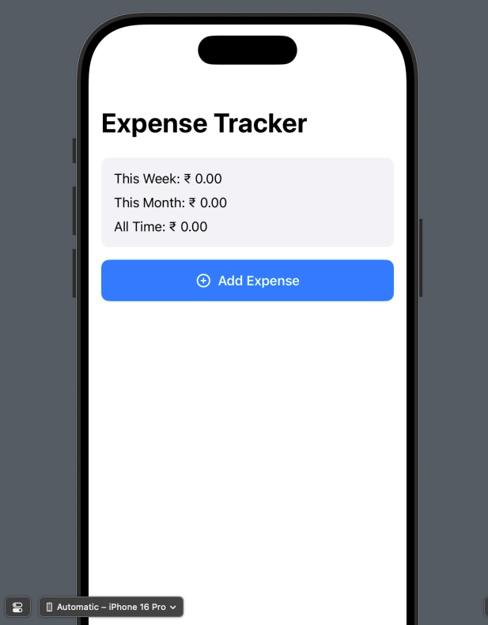

# TrackCash

---

## 🚀 Getting Started

1. Open `TrackCash.xcodeproj` in Xcode
2. Run the app on the simulator or a connected device (iOS 15+ recommended)
3. Add your expenses and start tracking!

---

## 🛠️ Technologies Used

- Swift 5
- SwiftUI
- Combine (for reactive state management)
- MVVM Design Pattern

---

## 🧩 Future Improvements

- Persistent storage using CoreData or UserDefaults
- Analytics with charts (Pie/Bar)
- Search & filter expenses
- iCloud sync
- Dark mode UI polish

---

## 📸 Preview

---

## 📄 License

MIT License — free to use and modify.

